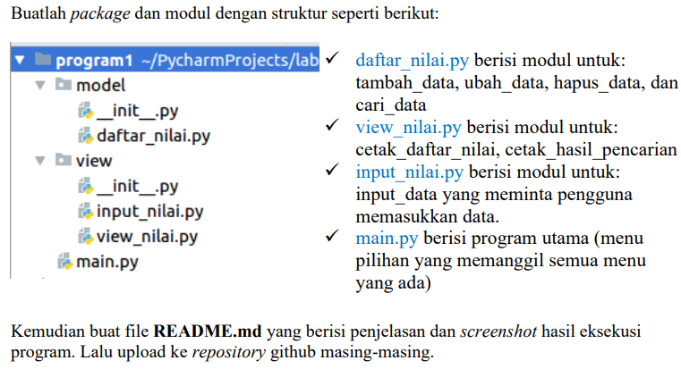
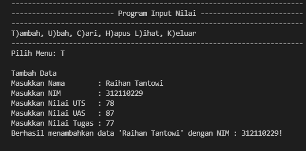
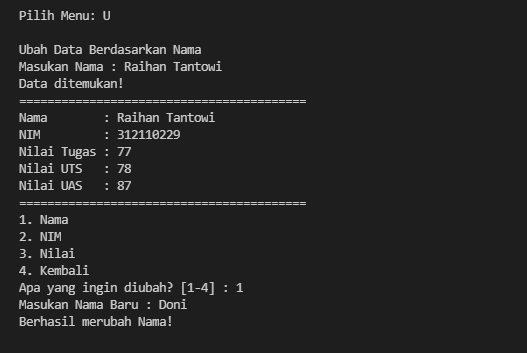
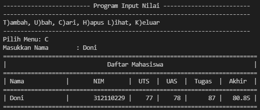
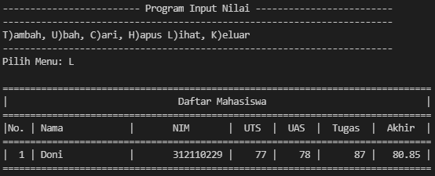
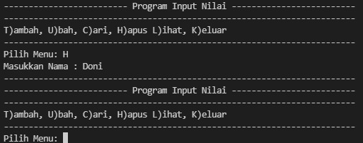
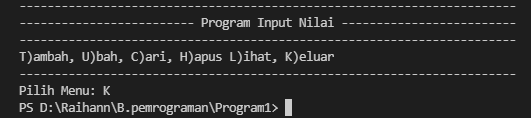
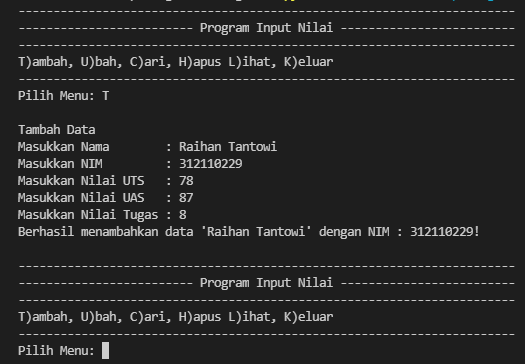

# UAS
## Package & Modul - Bahasa Pemrograman

```sh
Nama   : Raihan Tantowi
Nim    : 312110229
Matkul : Bahasa Pemrograman
```

* **SOAL**



## Penjelasan : 
Pada directory model dan view merupakan sebuah package yang didalamnya terdapat sekumpulan modul python yang berada dalam sebuah folder serta memiliki satu modul constructor `__init__.py`. Dengan struktur, seperti pada package  model yang isinya terdapat modul `daftar_nilai.py` serta file python yang bernama `__init__.py`. Sedangkan package view yaitu isinya terdapat modul `input_nilai.py` dan `view_nilai.py` serta file python juga yang bernama `__init__.py`. Pada file python `__init__.py` berfungsi untuk memberi tahu python interpreter bahwa folder tersebut adalah sebuah package. Jadi setiap direktori atau folder yang berisi modul constructor `__init__.py` akan diperilakukan sebagai package. Sedangkan file python `main.py` berisi program utama (menu pilihan yang memanggil semua menu yang ada).

### 1. Model
* **Daftar_nilai.py**

Pada file daftar_nilai.py dalam sebuah package model yaitu berisi modul untuk : tambah_data, ubah_data, hapus_data, dan cari_data.
```python
from view.input_nilai import *

class data_mahasiswa():
    def __init__(self, nama, nim, uts, uas, tugas):
        self.nama = nama
        self.nim = nim
        self.uts = uts
        self.uas = uas
        self.tugas = tugas
        hasil_akhir = tugas * 30/100 + uts * 35/100 + uas * 35/100
        self.akhir = hasil_akhir

mahasiswa = {}
def tambah_data():
    print("\nTambah Data")
    nama = input_nama()
    nim = input_nim()
    uts = input_uts()
    uas = input_uas()
    tugas = input_tugas()
    akhir = nilai_akhir()
    mahasiswa[nama] =  [nim, tugas, uts, uas, akhir]
    print(f"Berhasil menambahkan data '{nama}' dengan NIM : {nim}!\n")


def ubah_data():
    print("\nUbah Data Berdasarkan Nama")
    nama = input("Masukan Nama : ")
    if nama in mahasiswa.keys():
        print(f"Data ditemukan!")
        print(41*"=")
        print(f"Nama        : {nama}")
        print(f"NIM         : {mahasiswa[nama][0]}")
        print(f"Nilai Tugas : {mahasiswa[nama][1]}")
        print(f"Nilai UTS   : {mahasiswa[nama][2]}")
        print(f"Nilai UAS   : {mahasiswa[nama][3]}")
        print(41*"=")

        while True:
            print("1. Nama\n2. NIM\n3. Nilai\n4. Kembali")
            try:
                tanya = int(input("Apa yang ingin diubah? [1-4] : "))
                if tanya == 1:
                    _nama = input("Masukan Nama Baru : ")
                    mahasiswa[_nama] = mahasiswa.pop(nama)
                    print("Berhasil merubah Nama!\n")

                elif tanya == 2:
                    _nim = int(input("Masukan Nim Baru : "))
                    mahasiswa[nama][0] = _nim
                    print("Berhasil merubah NIM!\n")

                elif tanya == 3:
                    _nilaiTugas = int(input("Masukan Nilai Tugas Baru : "))
                    _nilaiUTS = int(input("Masukan Nilai UTS Baru   : "))
                    _nilaiUAS = int(input("Masukan Nilai UAS Baru   : "))
                    _nilaiAkhir = _nilaiTugas * 30/100 + _nilaiUTS * 35/100 + _nilaiUAS * 35/100
                    mahasiswa[nama][1:4] = _nilaiTugas, _nilaiUTS, _nilaiUAS, _nilaiAkhir
                    print("Berhasil merubah data nilai!\n")

                elif tanya == 4:
                    pass
                    
            except ValueError:
                print("Pilihan tidak ada! Silahkan masukan [1-4]")
                print(41*"=")
                
            else:
                break

    else:
        print("Nama {0} tidak ditemukan".format(nama))


def hapus_data():
    nama = input("Masukkan Nama : ")
    if nama in mahasiswa.keys():
        del mahasiswa[nama]
    else:
        print("Nama {0} Tidak Ditemukan".format(nama))


def cari_data():
    nama = input("Masukkan Nama : ")
    if nama in mahasiswa.keys():
        print("=" * 73)
        print("|                             Daftar Mahasiswa                          |")
        print("=" * 73)
        print("| Nama            |       NIM       |  UTS  |  UAS  |  Tugas  |  Akhir  |")
        print("=" * 73)
        print("| {0:15} | {1:15} | {2:5d} | {3:5d} | {4:7d} | {5:7.2f} |"
            .format(nama, mahasiswa[nama][0], mahasiswa[nama][1], mahasiswa[nama][2], mahasiswa[nama][3], mahasiswa[nama][4]))
        print("=" * 73)


```

#### Penjelasan kode program daftar_nilai.py
- Membuat Class dengan nama `data_mahasiswa` yang menggabungkan parameter dengan variable
```python
class data_mahasiswa():
    def __init__(self, nama, nim, uts, uas, tugas):
        self.nama = nama
        self.nim = nim
        self.uts = uts
        self.uas = uas
        self.tugas = tugas
        hasil_akhir = tugas * 30/100 + uts * 35/100 + uas * 35/100
        self.akhir = hasil_akhir
```

- Membuat variabel dict dengan nama `mahasiswa` dengan nilai kosong, lalu terdapat function `def tambah_data` yang berfungsi untuk Menambah Data Mahasiswa
```python
def tambah_data():
    print("\nTambah Data")
    nama = input_nama()
    nim = input_nim()
    uts = input_uts()
    uas = input_uas()
    tugas = input_tugas()
    akhir = nilai_akhir()
    mahasiswa[nama] =  [nim, tugas, uts, uas, akhir]
    print(f"Berhasil menambahkan data '{nama}' dengan NIM : {nim}!\n")
```

- Pada function `def ubah_data` befungsi untuk Mengubah Data Mahasiswa berdasarkan nama, namun jika nama tidak ada didalam data, maka program akan menampilkan "Nama tidak ditemukan"
```python
def ubah_data():
    print("\nUbah Data Berdasarkan Nama")
    nama = input("Masukan Nama : ")
    if nama in mahasiswa.keys():
        print(f"Data ditemukan!")
        print(41*"=")
        print(f"Nama        : {nama}")
        print(f"NIM         : {mahasiswa[nama][0]}")
        print(f"Nilai Tugas : {mahasiswa[nama][1]}")
        print(f"Nilai UTS   : {mahasiswa[nama][2]}")
        print(f"Nilai UAS   : {mahasiswa[nama][3]}")
        print(41*"=")
        ...
```

- Kodingan ini digunakan untuk penghapusan sebuah data pada program yang sebelumnya telah diinput. Dan inputan dari kodingan ini berdasarkan "nama" yang sebelumnya telah diinput.
```python
def hapus_data():
    nama = input("Masukkan Nama : ")
    if nama in mahasiswa.keys():
        del mahasiswa[nama]
    else:
        print("Nama {0} Tidak Ditemukan".format(nama))
```

- Method cari data berfungsi untuk menampilkan data yg dicari berdasarkan nama
```python
def cari_data():
    nama = input("Masukkan Nama : ")
    if nama in mahasiswa.keys():
        print("=" * 73)
        print("|                             Daftar Mahasiswa                          |")
        print("=" * 73)
        print("| Nama            |       NIM       |  UTS  |  UAS  |  Tugas  |  Akhir  |")
        print("=" * 73)
        print("| {0:15} | {1:15} | {2:5d} | {3:5d} | {4:7d} | {5:7.2f} |"
            .format(nama, mahasiswa[nama][0], mahasiswa[nama][1], mahasiswa[nama][2], mahasiswa[nama][3], mahasiswa[nama][4]))
        print("=" * 73)
```

### 2. View
* **Input_nilai.py**

Pada file `input_nilai.py` dalam sebuah package view yaitu berisi modul untuk : input_data yang meminta pengguna 
memasukkan data.
```python
# Menginput data
def input_nama():
    global nama
    while True:
        nama = input("Masukkan Nama        : ") 
        if nama == "":
            print("Nama Tidak Boleh Kosong!\n")
            print("Masukan Nama dengan Benar")
        else:
            return nama


def input_nim():
    global nim
    while True:
        try:
            nim = int(input("Masukkan NIM         : "))
            if nim == "":
                print("NIM Tidak Boleh Kosong!")
        except ValueError:
            print("\nMasukan NIM Dengan Angka")
        else:
            return nim


def input_tugas():
    global tugas
    while True:
        try:
            tugas = int(input("Masukkan Nilai Tugas : "))
            if tugas == "":
                print("Nilai Tugas Tidak Boleh Kosong!")
        except ValueError:
            print("\nMasukan Nilai Tugas Dengan Angka")
        else:
            return tugas


def input_uts():
    global uts
    while True:
        try:
            uts = int(input("Masukkan Nilai UTS   : "))
            if uts == "":
                print("Nilai UTS Tidak Boleh Kosong!")
        except ValueError:
            print("\nMasukan Nilai UTS Dengan Angka")
        else:
            return uts


def input_uas():
    global uas
    while True:
        try:
            uas = int(input("Masukkan Nilai UAS   : "))
            if uas == "":
                print("Nilai UAS Tidak Boleh Kosong!")
        except ValueError:
            print("\nMasukan Nilai UAS Dengan Angka")
        else:
            return uas

def nilai_akhir():
    global akhir
    akhir = tugas * 30/100 + uts * 35/100 + uas * 35/100
    return akhir
```

#### Penjelasan kode program input_nilai.py
- Membuat modul input data, yang berisi variable `nama`, `nim`, `tugas`, `uts`, `uas`, dan `akhir` menggunakan variable global dan juga menggunakan statement try and except. agar ketika pengguna melakukan kesalahan program itu tidak akan error secara tidak wajar
```python
def input_nama():
    global nama
    while True:
        nama = input("Masukkan Nama        : ") 
        if nama == "":
            print("Nama Tidak Boleh Kosong!\n")
            print("Masukan Nama dengan Benar")
        else:
            return nama
def input_nim():
    global nim
    while True:
        try:
            nim = int(input("Masukkan NIM         : "))
            if nim == "":
                print("NIM Tidak Boleh Kosong!")
        except ValueError:
            print("\nMasukan NIM Dengan Angka")
        else:
            return nim
    ...
```

* **view_nilai.py**

Pada file `view_nilai.py` dalam sebuah package view yaitu berisi modul untuk : cetak_daftar_nilai dan cetak_hasil_pencarian
```python
# Menampilkan data

from model.daftar_nilai import *

class View_Nilai:
    def __init__(self, list = []):
        self.list = []

def cetak_daftar_nilai():
    if mahasiswa.items():
        print()
        print("=" * 78)
        print("|                               Daftar Mahasiswa                             |")
        print("=" * 78)
        print("|No. | Nama            |       NIM       |  UTS  |  UAS  |  Tugas  |  Akhir  |")
        print("=" * 78)
        i = 0
        for z in mahasiswa.items():
            i += 1
            print("| {no:2d} | {0:15} | {1:15} | {2:5d} | {3:5d} | {4:7d} | {5:7.2f} |"
                .format(z[0][:13], z[1][0], z[1][1], z[1][2], z[1][3], z[1][4], no=i))
        print("=" * 78)
        print()
    else:
        print("=" * 78)
        print("|                               Daftar Mahasiswa                             |")
        print("=" * 78)
        print("|No. | Nama            |       NIM       |  UTS  |  UAS  |  Tugas  |  Akhir  |")
        print("=" * 78)
        print("|                              TIDAK ADA DATA                                |")
        print("=" * 78)


def cetak_hasil_pencarian():
    nama = input("Masukkan Nama        : ")
    if nama in mahasiswa.keys():
        print("=" * 73)
        print("|                             Daftar Mahasiswa                          |")
        print("=" * 73)
        print("| Nama            |       NIM       |  UTS  |  UAS  |  Tugas  |  Akhir  |")
        print("=" * 73)
        print("| {0:15} | {1:15} | {2:5d} | {3:5d} | {4:7d} | {5:7.2f} |"
            .format(nama, mahasiswa[nama][0], mahasiswa[nama][1], mahasiswa[nama][2], mahasiswa[nama][3], mahasiswa[nama][4]))
        print("=" * 73)
```

#### Penjelasan kode program view_nilai.py
- Kodingan dibawah berfungsi untuk mengimport semua modul pada daftar_nilai agar dapat di akses kedalam program `view_nilai.py`
```python
from model.daftar_nilai import *
```

- Membuat class berfungsi untuk menampilkan Daftar Data Mahasiswa. Dan program akan mengeksekusi statement else jika tidak ada data
```python
class View_Nilai:
    def __init__(self, list = []):
        self.list = []
def cetak_daftar_nilai():
    if mahasiswa.items():
        print()
        print("=" * 78)
        print("|                               Daftar Mahasiswa                             |")
        print("=" * 78)
        print("|No. | Nama            |       NIM       |  UTS  |  UAS  |  Tugas  |  Akhir  |")
        print("=" * 78)
        i = 0
        for z in mahasiswa.items():
            i += 1
            print("| {no:2d} | {0:15} | {1:15} | {2:5d} | {3:5d} | {4:7d} | {5:7.2f} |"
                .format(z[0][:13], z[1][0], z[1][1], z[1][2], z[1][3], z[1][4], no=i))
        print("=" * 78)
        print()
    else:
        print("=" * 78)
        print("|                               Daftar Mahasiswa                             |")
        print("=" * 78)
        print("|No. | Nama            |       NIM       |  UTS  |  UAS  |  Tugas  |  Akhir  |")
        print("=" * 78)
        print("|                              TIDAK ADA DATA                                |")
        print("=" * 78)
```

- Kodingan dibawah berfungsi untuk menampilkan hasil pencarian
```python
def cetak_hasil_pencarian():
    nama = input("Masukkan Nama        : ")
    if nama in mahasiswa.keys():
        print("=" * 73)
        print("|                             Daftar Mahasiswa                          |")
        print("=" * 73)
        print("| Nama            |       NIM       |  UTS  |  UAS  |  Tugas  |  Akhir  |")
        print("=" * 73)
        print("| {0:15} | {1:15} | {2:5d} | {3:5d} | {4:7d} | {5:7.2f} |"
            .format(nama, mahasiswa[nama][0], mahasiswa[nama][1], mahasiswa[nama][2], mahasiswa[nama][3], mahasiswa[nama][4]))
        print("=" * 73)
```

### 3. Main.py
Pada modul `main.py` berisi program utama (menu pilihan yang memanggil semua menu yang ada).

#### Penjelasan kode program main.py
- Berfungsi untuk mengimport module module yang ada diluar program utama `main.py`
```python
from model.daftar_nilai import *
from view.view_nilai import *
```

- Untuk melakukan perulangan pada program dan Menu untuk menambah, ubah, hapus, cetak hasil pencarian dan cetak data mahasiswa.
```python
while True:
    print(71*"-")
    print(25*"-", "Program Input Nilai", 25*"-")
    print(71*"-")
    print("T)ambah, U)bah, C)ari, H)apus L)ihat, K)eluar")
    print(71*"-") 
    c = input("Pilih Menu: ")
    if c.lower() == 't' or c.lower() == 'T':
        tambah_data()
    elif c.lower() == 'u' or c.lower() == 'U':
        ubah_data()
    elif c.lower() == 'c' or c.lower() == 'C':
        cetak_hasil_pencarian()
    elif c.lower() == 'h' or c.lower() == 'H':
        hapus_data()
    elif c.lower() == 'l' or c.lower() == 'L':
        cetak_daftar_nilai()
    elif c.lower() == 'k' or c.lower() == 'K':
        break
    else:
        print("Silahkan pilih menu yang tersedia\n")
```

### Output program
* **Tambah data**



* **Ubah data**



* **Cari data**



* **Lihat data**



* **Hapus data**



* **Keluar program**



## **Apabila semua program disatukan kedalam satu file dan di run hasilnya akan seperti berikut**

